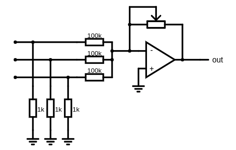
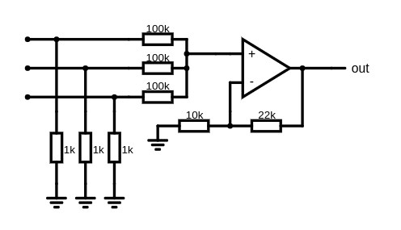
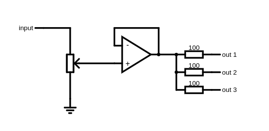
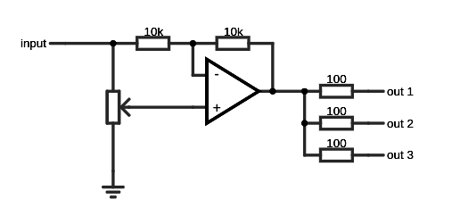

# rack
Motherboard with power and base audio output for synth modules

## Mechanical specifications

* module height
* supply placings
* mount holes

## Mechanical recommendations

* module width as small as possible
* height of controls
* minimal distance between controls

## Electrical specifications

* Supply voltage: ±9 volt, ±5%
* Maximum supply current: 500 mA @ -9V / 1000 mA @ +9V (it is total maximum current of all modules)
* Recommended supply current: 50 mA @ -9 V / 50 mA @ -9V

## Electrical recommendations (for interconnect)

* High impedance input (1kOhm typ.)
* Many inputs (sum), many outpus (parallel)
* Use terminator on inputs to prevent change level on connect new source
* Adjustable level of input (common only)

Adjustable sum input example (note: this schematic invert input signal):

Non-adjustable and noninverting input schematic (you can add optional potentiometer next):

* Protect outputs with resistors (100 ohm typ.)
* Low impedance output (100 ohm typ.)
* Adjust level of output, common only

* Use attenuverter for CV outputs

* use linear regulator for power supply

### Signal level considerations
* 5V gate
* 1 V/oct CV
* 5 Vpp linear level (0 dB)
